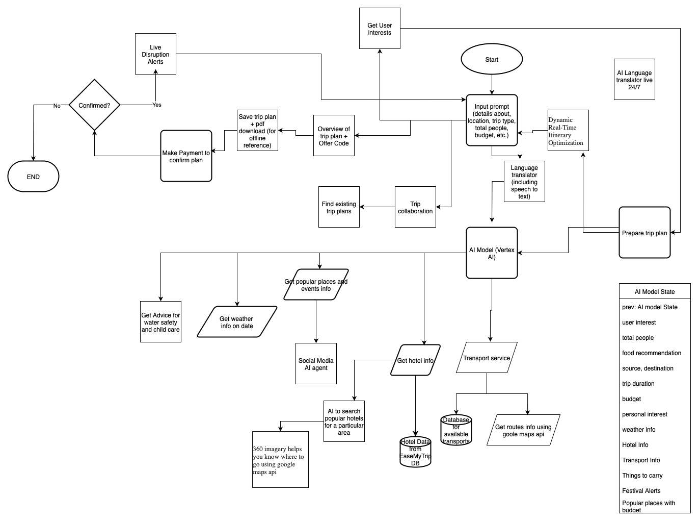

# AI-powered-personalized-trip-planner
Develop an AI-powered personalized trip planner that dynamically creates end-to-end itineraries tailored to individual budgets, interests, and real-time conditions with seamless booking capabilities.

## Explanation

Watch the demo video to see how the AI-powered personalized trip planner works in real time.

## Process Chart
Process chart describes the agentic AI workflow of the Personalized AI Trip Planner solution

 
 
 
# Built By:  Team Kakashi

- [Dhruv Patel](https://github.com/Deathkiller18) <b>(Team Leader)</b>
- [Bhavay Savaliya](https://github.com/bhavaysavaliya)
- [Niraj Patel](https://github.com/niraj1402)
- [Niteesh Sai](https://github.com/githubsampl)
- [Harh Parashar](https://github.com/Harsh151999)
